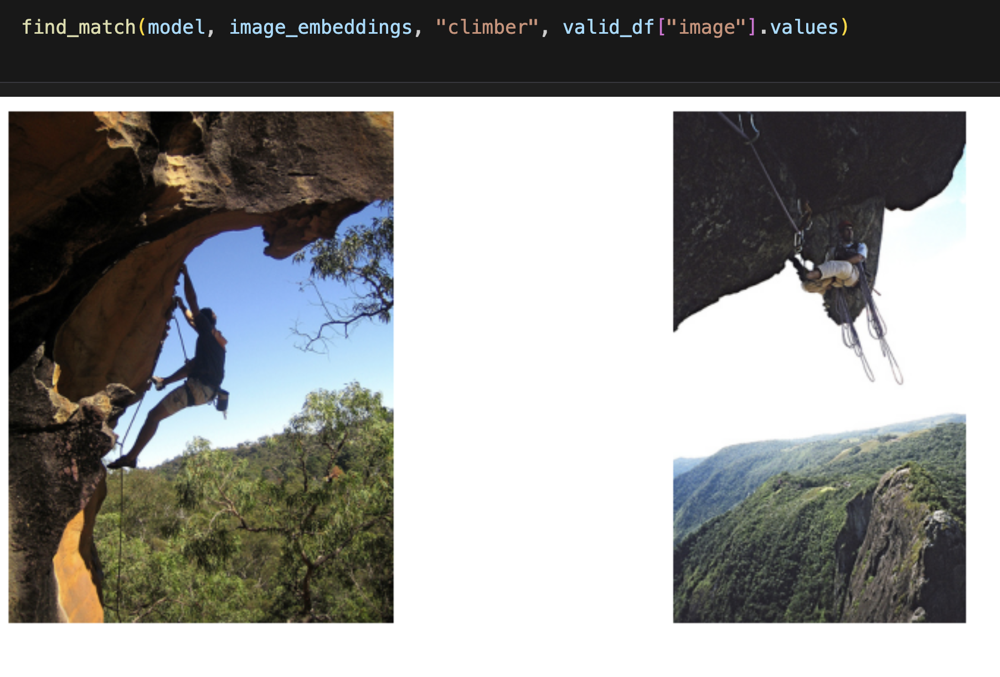

# Small CLIP Model

An implementation of a model inspired by the original [CLIP](https://arxiv.org/abs/2103.00020) paper, aimed at learning a shared space for images and their captions.

The model uses frozen encoders:
- **ResNet50** for images
- **DistilBERT** for text

---

## Demo

Below is an example of the model's output: it finds images from the dataset that best match a given text query.

  

---

## Repository Structure

- `CLIPDataset.py` — dataset class that processes images and tokenizes captions.
- `ImageEncoder.py` — image encoder class based on ResNet50.
- `TextEncoder.py` — text encoder class that extracts the CLS token from DistilBERT.
- `ProjectionHead.py` — shared projection head: two-layer MLP with GELU, Dropout, LayerNorm, and skip-connection.

---

## Training Details

- Optimized using contrastive loss between image embeddings and their corresponding captions
- Use of pretrained and frozen encoders
- [Training data](https://www.kaggle.com/datasets/keenwarrior/small-flicker-data-for-image-captioning)
